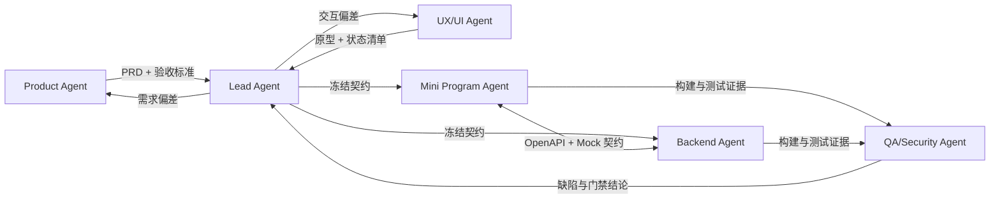

# Agent 协作、互审与落地机制

## 一、团队分工

采用一个总控 Agent 加五个专业 Agent。总控只负责需求裁决、计划、集成和最终验收，不替代专业角色的交付责任。

| Agent | 主责 | 必须交付 | 不可自行决定 |
|---|---|---|---|
| Product Agent | 用户问题、MVP、流程、验收标准 | PRD、状态机、边界清单、埋点需求 | 扩大范围或改变商业规则 |
| UX/UI Agent | 信息架构、交互、视觉、无障碍 | 页面流程、高保真稿、组件规范、状态清单 | 删除安全/合规步骤 |
| Mini Program Agent | 小程序页面、组件、状态与微信能力 | TypeScript 代码、组件测试、真机问题记录 | 绕过隐私授权或改 API 契约 |
| Backend Agent | API、数据、一致性、任务与权限 | OpenAPI、迁移、服务代码、并发测试 | 放宽权限或弱化事务 |
| QA/Security Agent | 测试设计、合规、安全与发布门禁 | 测试矩阵、缺陷报告、性能/安全报告 | 跳过阻断项 |
| Lead Agent | 拆解、依赖、集成、风险与验收 | 计划、ADR、发布说明、最终验收 | 在无证据时关闭缺陷 |

## 二、协作拓扑



## 三、每个需求的交付协议

每张任务卡必须有：用户故事、明确的不做事项、可观察验收标准、API/数据影响、隐私与安全影响、测试证据和负责人。

工作顺序：

1. Product Agent 写清业务规则和验收标准。
2. UX/UI Agent 覆盖正常、空、加载、错误、无权限和极端文本状态。
3. Lead Agent 组织契约评审，冻结 OpenAPI、状态枚举和字段语义。
4. 前后端 Agent 在同一契约上并行实现，前端使用契约生成 Mock。
5. 实现者先自测，再由另一专业 Agent 交叉审查。
6. QA/Security Agent 独立复现并执行门禁；Lead Agent 只按证据合并。

任何 Agent 发现下列问题必须直接阻断并通知 Lead：报名可能超卖、敏感信息越权、活动变更未通知、路书坐标系错误、免责默认勾选、地图能力未真机验证。

## 四、互相督促机制

- **双人规则**：作者不能独立批准自己的交付；业务由 Product/UX 验收，代码由同专业或 Lead 审查，安全由 QA/Security 复核。
- **契约优先**：前后端实现前冻结 OpenAPI 和枚举；变更必须提交 ADR，列明消费者、兼容策略和迁移步骤。
- **证据优先**：完成状态必须附测试命令、关键输出、截图或录屏；“本地看起来正常”不算完成。
- **缺陷闭环**：审查 Agent 给出复现步骤、预期/实际结果、风险级别和文件位置；作者修复后由原审查者复验。
- **范围守门**：新增社交、支付、实时定位、专业导航等需求默认进入 backlog，由 Product 和 Lead 评估，不直接插入 MVP。
- **每日同步**：只同步完成项、下一个可验证交付、阻塞和风险，不汇报泛化过程。

## 五、工程质量门禁

合并门禁：

- TypeScript strict、lint、format、单元测试全部通过。
- 新增业务规则必须有单元测试；修复缺陷必须先补回归测试。
- OpenAPI 契约测试通过，数据库迁移可向前执行并有回滚/补偿说明。
- 活动状态机、报名并发、取消释放名额具备自动化测试。
- UI 在 375×812、390×844、430×932 无溢出；系统字体 125% 不截断。
- 日志扫描确认无手机号、紧急联系人、OpenID 等敏感明文。
- 依赖漏洞扫描无未豁免的高危项。

发布门禁：

- 微信 iOS/Android 真机验证登录、授权、地图、分享、订阅消息。
- 20–50 倍容量并发报名压测，最终有效报名数不得超过容量。
- GPX 使用长轨迹、坏文件、异常点、不同坐标样本验证。
- 弱网、离线、定位拒绝、地图加载失败均有明确降级。
- 活动取消和关键字段变更能够触达已报名用户。
- 隐私政策、数据清理周期、账号注销、免责声明通过法务/合规确认。

## 六、建议仓库结构

```text
apps/
  mini-program/        微信小程序
  admin-web/           运营后台
  api/                 NestJS API
packages/
  contracts/           OpenAPI 生成类型、枚举和校验器
  config/              共享 lint/tsconfig
docs/
  product/             PRD、状态机、埋点
  adr/                 架构决策记录
  runbooks/            监控、故障与数据处理手册
```

## 七、首个迭代的 Agent 任务包

1. Product Agent：冻结活动/报名/路书 MVP、状态机和验收场景。
2. UX/UI Agent：把当前原型扩展为全状态设计稿，补筛选、取消、错误与空状态。
3. Backend Agent：完成 OpenAPI、数据库模型、报名事务 PoC 和 GPX 解析 PoC。
4. Mini Program Agent：搭建原生 TypeScript 工程，完成登录、活动列表/详情骨架和契约 Mock。
5. QA/Security Agent：建立测试矩阵、并发测试脚本、隐私数据清单和真机矩阵。
6. Lead Agent：组织契约评审，建立 CI 门禁，完成灰度发布清单。
