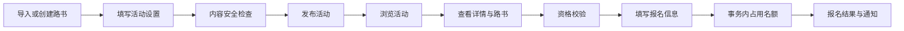
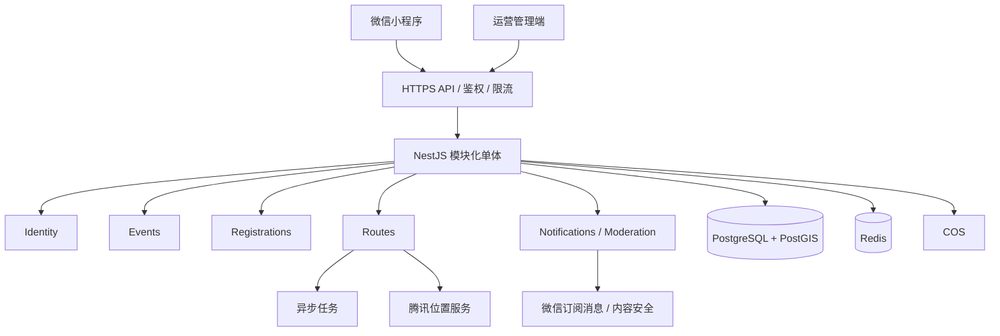

# 公路骑行活动小程序：产品与系统架构方案

## 一、产品判断

首版不是骑行社区，而是一个把微信群里的活动组织流程结构化的工具。核心价值只有三项：骑友快速判断活动是否适合自己、完成可靠报名、在出发前拿到可信路书与风险信息；组织者则能快速发布并管理名额。

### 用户角色

| 角色 | 首版能力 |
|---|---|
| 游客 | 浏览公开活动和公开路书，报名时登录 |
| 骑友 | 报名、取消、收藏路书、查看我的活动 |
| 组织者 | 发布活动/路书、管理名单、变更或取消活动 |
| 平台管理员 | 内容审核、活动治理、举报和审计 |

### MVP 必须完成

- 微信授权登录、用户协议和隐私政策
- 活动列表、基础筛选、活动详情
- 报名、取消、名额释放、我的活动
- 活动发布、编辑、取消、报名名单
- GPX 导入，轨迹抽稀，地图、海拔和 POI 展示
- 报名结果、活动变更和出发提醒
- 内容安全检查和极简运营后台

### MVP 明确不做

- 动态、评论、私信、排行榜等泛社交
- 在线支付、保险购买和退款
- 实时位置共享与轨迹记录
- 专业逐向导航与自动重规划
- 复杂俱乐部权限、会员和积分体系

## 二、关键流程和规则

活动状态：`draft → published ↔ full → completed`，`published/full → cancelled`。活动不做物理删除，保留状态和审计记录。

报名约束：

- 同一用户对同一活动只能存在一条有效报名。
- 名额校验、报名记录和活动计数必须位于同一数据库事务。
- 报名接口使用 `Idempotency-Key`，避免重复点击产生重复记录。
- 已有报名后修改时间、集合点、路线或强度，必须通知已报名用户。
- 联系方式和紧急联系人最小化采集、加密存储，活动结束后按策略脱敏或删除。
- 免责确认记录协议版本与确认时间，但不能替代组织者安全责任。

路书规则：

- 原始轨迹保存 WGS84；微信地图展示前转换为 GCJ-02。
- 服务端限制 GPX 大小、轨迹点数量，并完成异常点清洗和多级抽稀。
- 距离、爬升、最大坡度等原始指标必须可见，难度标签不能成为唯一依据。
- 首版称为“路线参考/轨迹跟随”，集合点可调用系统地图导航。

## 三、推荐技术架构

| 层级 | 推荐方案 | 选择理由 |
|---|---|---|
| 小程序 | 微信原生 + TypeScript + TDesign Miniprogram | 微信能力、地图和包体兼容风险最低 |
| API | NestJS 模块化单体 | 类型边界明确、交付快、后续可拆分 |
| 数据库 | PostgreSQL + PostGIS | 同时承担报名事务与空间数据 |
| 缓存 | Redis | 热点、限流、幂等和短期状态 |
| 文件 | 腾讯云 COS | GPX 与活动封面 |
| 地图 | 腾讯位置服务 + 微信地图组件 | 微信生态匹配 |
| 异步任务 | BullMQ 或云队列 | GPX 解析、通知、状态任务 |
| 管理端 | React + Ant Design | 内部治理与审核效率 |

第一版不拆微服务。活动、报名和路书关系紧密，模块化单体更容易保证一致性。通知或轨迹解析在流量独立增长后再拆。

模块边界：

- `Identity`：微信登录、Token、资料与隐私授权
- `Events`：活动生命周期、发布、检索、变更与取消
- `Registrations`：容量、报名、取消、名单、事务与幂等
- `Routes`：GPX、轨迹、途经点和统计指标
- `Notifications`：订阅消息、模板与发送记录
- `Moderation/Admin`：内容审核、下架、举报和审计

## 四、核心数据模型

核心表为 `users`、`routes`、`route_waypoints`、`events`、`registrations`、`notification_deliveries`、`content_moderation_records` 和 `admin_audit_logs`。

`events` 需要包含组织者、路书、起止和截止时间、集合点、速度区间、难度、容量、已报名计数、装备要求、安全说明、状态和版本号。

`registrations` 需要包含活动、用户、报名状态、加密联系方式、能力确认、免责协议版本/时间、取消时间。数据库建立 `(event_id, user_id)` 唯一约束。

`routes` 需要保存 PostGIS `LINESTRING`、抽稀轨迹、海拔曲线、GPX 对象键、统计指标、可见性和状态；POI 使用独立表保存 `POINT`、类型与顺序。

## 五、API 边界

统一前缀 `/api/v1`：

- `POST /auth/wechat/login`，`GET/PATCH /me`
- `GET/POST /events`，`GET/PATCH /events/:id`
- `POST /events/:id/publish|cancel`
- `POST /events/:id/registrations`
- `DELETE /events/:id/registrations/me`
- `GET /events/:id/registration-status|registrations`
- `GET/POST /routes`，`GET/PATCH /routes/:id`
- `POST /route-imports`，`GET /route-imports/:taskId`
- `GET /routes/:id/track?level=`，`POST /routes/:id/waypoints`

客户端不直连数据库和对象存储；GPX 使用短期预签名地址上传。

## 六、非功能门槛

- 普通 API P95 小于 800ms，活动列表首屏小于 300KB。
- 报名无超卖，状态变化具备补偿任务，所有敏感访问留审计日志。
- 手机号和紧急联系人字段加密，日志禁止出现明文。
- GPX 解析和通知支持幂等、重试和失败队列。
- 监控 API 错误率、报名失败率、消息失败率和任务积压。
- 上线前完成个人信息保护、微信小程序隐私要求、内容安全和活动免责声明法务审核。

## 七、迭代与验收

| 阶段 | 时间建议 | 范围 |
|---|---:|---|
| 方案与验证 | 1 周 | 可点击原型；访谈 3–5 位组织者、10 位骑友；冻结 PRD 和接口 |
| MVP | 4–6 周 | 登录、活动、报名、发布、GPX 路书、通知、极简后台 |
| 运营增强 | 3–4 周 | 候补/审核、俱乐部主页、认证、举报、路书版本 |
| 骑行增强 | 数据验证后 | 安全报平安、轨迹记录、外部导航联动、付费与保险 |

首版验收：3 分钟内完成报名，5 分钟内基于已有路书发布活动，GPX 导入成功率 ≥95%，报名容量零超卖，灰度期核心 API 成功率 ≥99.5%。
